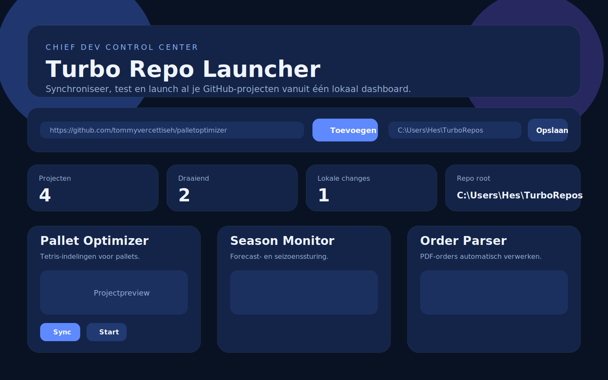

# Turbo Repo Launcher

Moderne lokale launcher waarmee je al je GitHub-projecten op één plek beheert, synchroniseert en lokaal start.



## Functies

• GitHub-repo toevoegen via URL
• Repo lokaal clonen naar een vaste map
• `turbo-project.json` automatisch uitlezen
• Moderne dashboardweergave met gradients, cards en vectors
• Git-status bekijken
• `git fetch` en `git pull` uitvoeren
• Project lokaal starten en stoppen
• Projectmap openen
• Project openen in Visual Studio Code
• Preview per project tonen

## Snel starten op Windows

1. Clone of download deze repository.
2. Dubbelklik op **Start Turbo Repo Launcher.bat**.
3. De launcher maakt automatisch een virtuele Python-omgeving.
4. Dependencies worden automatisch geïnstalleerd.
5. De browser opent op `http://127.0.0.1:8787`.

## Standaard projectmap

Repos worden standaard geplaatst in:

```text
%USERPROFILE%\TurboRepos
```

Dit pad kan vanuit de launcher worden aangepast.

## Projectmanifest

De launcher werkt het beste wanneer een project een `turbo-project.json` bevat:

```json
{
  "name": "Pallet Optimizer",
  "slug": "palletoptimizer",
  "version": "0.4.0",
  "description": "Palletoptimalisatie met vrije Tetris-indelingen.",
  "preview": "docs/preview-mobile.svg",
  "start_command": "Start Pallet Insight.bat",
  "default_port": 8000,
  "health_url": "http://127.0.0.1:8000/health"
}
```

## Techniek

• FastAPI
• Jinja2
• Vanilla JavaScript
• Moderne CSS met responsive cards
• Python subprocess voor Git en launch-acties

## Roadmap

De volgende stappen zijn automatische repo-detectie, tests per project, changelogweergave en later een veilige deployflow.